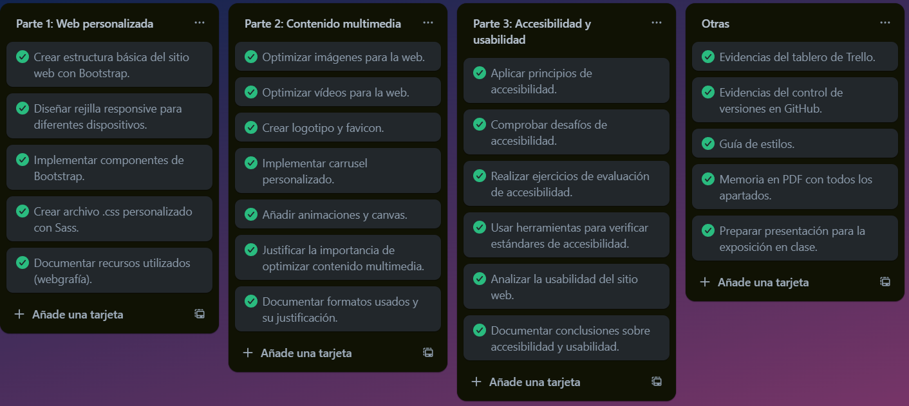
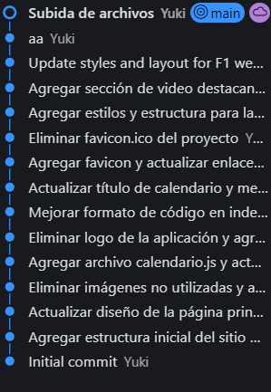

# Documentación Técnica del Proyecto

Proyecto realizado para el modulo de diseño de interfaces web

Este proyecto sigue como temática la f1

## Estructura del Proyecto
```
/root
├── css/               # Styles preprocesados y compilados
│   ├── styles.scss    # Fuente principal de estilos SCSS
│   ├── styles.css     # CSS compilado para producción
│   ├── equipos.css    # Estilos específicos de equipos
│   ├── pilotos.css    # Estilos específicos de pilotos
│   └── noticias.css   # Estilos específicos de noticias
├── html/              # Plantillas HTML modularizadas
│   ├── equipos.html   # Página de listado de equipos
│   ├── pilotos.html   # Página de perfil de pilotos
│   ├── noticias.html  # Página de noticias actuales
│   └── calendario.html # Calendario interactivo
├── img/               # Assets visuales optimizados
│   ├── f1_logo.svg    # Logo vectorial oficial
│   ├── patron.svg     # Patrón gráfico repetitivo
│   └── hero-img.jpg   # Imagen principal comprimida
├── script/            # Lógica interactiva
│   └── calendario.js  # Gestión de calendario dinámico
└── index.html         # Punto de entrada principal
```

**Relaciones entre componentes**:
- `styles.scss` importa partials de componentes
- HTML files referencian `styles.css` compilado
- Imágenes optimizadas para web (WebP + compresión JPEG)
- JavaScript modularizado por funcionalidad

## Especificaciones Técnicas

- **Core Framework**:
  - Bootstrap 5.3.0-alpha1 (CSS/JS utilities)
  - Sass 1.58.0 (Preprocesador CSS)

- **Dependencias**:
  - Font Awesome 6.0.0-beta3 (Sistema de iconos)
  - Autoprefixer 10.4.13 (Prefijos CSS)
  - PostCSS 8.4.21 (Optimización CSS)

- **Compatibilidad**:
  - Navegadores modernos (Chrome 108+, Firefox 101+)
  - Resoluciones: 320px - 4K
  - Soporte básico para IE11 (polyfills incluidos)

- **Build System**:
  - Node Sass compiler (SCSS → CSS)
  - LiveReload para desarrollo
  - Optimización de assets en producción


## Arquitectura SCSS
### Sistema de Capas
```scss
// 1. Configuración
@import 'variables', 'functions', 'mixins';

// 2. Vendor
@import 'bootstrap', 'font-awesome';

// 3. Componentes
@import 'components/navbar', 'components/hero', 'components/cards';

// 4. Utilidades
@import 'utilities/spacing', 'utilities/animations';
```

### Variables Avanzadas
```scss
// Sistema de color
$theme-colors: (
  primary: #c00000,
  secondary: #2b2b2b,
  danger: #dc3545,
  dark: #15151e
);

// Breakpoints responsivos
$breakpoints: (
  sm: 576px,
  md: 768px,
  lg: 992px,
  xl: 1200px
);

// Espaciado modular
$spacer: 1rem;
$spacers: (0: 0, 1: $spacer * 0.25, 2: $spacer * 0.5, 3: $spacer);
```

### Ejemplo de Mixin
```scss
@mixin media-breakpoint-down($breakpoint) {
  @if map-has-key($breakpoints, $breakpoint) {
    @media (max-width: map-get($breakpoints, $breakpoint)) {
      @content;
    }
  }
}
```

## Sistema de Color

| Variable            | Uso                              | Ejemplo de Implementación                 |
|---------------------|-----------------------------------|--------------------------------------------|
| `$primary-color`    | Botones, acentos visuales         | `background: $primary-color;`              |
| `$secondary-color`  | Fondos, bordes                    | `border: 2px solid $secondary-color;`      |
| `$text-gradient`    | Títulos importantes              | `background-image: $text-gradient;`       |
| `$success`          | Indicadores positivos            | `color: $success;`                         |
| `$dark`             | Textos y fondos oscuros          | `background: $dark;`                       |

**Implementación Responsive**:
```scss
.button-primary {
  background: $primary-color;
  @include media-breakpoint-down(md) {
    padding: 0.75rem 1.5rem;
  }
}


**Accesibilidad**:
- Contraste mínimo 4.5:1 para texto
- Variables verificadas con herramientas WCAG
- Sistema dark/light automático
```

## Breakpoints Responsivos
```scss
@include media-breakpoint-down(lg) { /* <= 992px */ }
@include media-breakpoint-down(md) { /* <= 768px */ }
@include media-breakpoint-down(sm) { /* <= 576px */ }
```

## Guía de Estilo


### Principios de Diseño
1. **Jerarquía Visual**: 
   - Sistema de escala modular (1.333)
   - Títulos usan relación 4:1 contra body text
   - Sombras texturales para profundidad
2. **Contraste Cinético**:
   - Transiciones hover: 300ms ease-in-out
   - Animaciones de carga: 500ms duration
   - Umbral de movimiento reducido en preferencias
3. **Densidad Adaptativa**:
   - Espaciado base: 8px (0.5rem)
   - Márgenes responsive: Desktop(32px) → Mobile(16px)
   - Padding adaptivo por breakpoint

### Tipografía

| Elemento | Familia | Fuente | Tamaño | Ratio | Peso | Color |
|----------|---------|--------|--------|-------|------|-------|
| H1 | Roboto Condensed | [Google Fonts](https://fonts.google.com) | 2.5rem | 1.2 | 700 | `$text-gradient` |
| Body Text | Roboto | [Google Fonts](https://fonts.google.com) | 1rem | 1.6 | 400 | `rgba($text-color, 0.9)` |
| Navbar | Formula1 Display | [F1 Assets](https://www.formula1.com) | 1.1rem | 1.4 | 500 | `$text-color` |
| Botones | Roboto Condensed | CDN | 1.25rem | 1 | 600 | `#ffffff` |


### Sistema de Animación
```scss
// Capas de animación
$animation-easing: (
  ease-in-out: cubic-bezier(0.4, 0, 0.2, 1),
  material: cubic-bezier(0.4, 0, 0.2, 1)
);

@keyframes contextual-entrance {
  0% { 
    opacity: 0;
    transform: translateY(20px) scale(0.95);
  }
  100% { 
    opacity: 1;
    transform: none;
  }
}

.animate {
  &-contextual {
    animation: contextual-entrance 0.6s map-get($animation-easing, material);
  }

  &-performance {
    @media (prefers-reduced-motion: reduce) {
      animation-duration: 0.01ms;
    }
  }
}
```

## Accesibilidad

### Principios Generales

1. **Navegación y Estructura**:
 - Orden de tabulación lógico y predecible (tabindex)
 - Skip links para saltar al contenido principal
 - Focus states visibles con alto contraste (3:1 mínimo)
 - Breadcrumbs para orientación del usuario
 - Menús desplegables operables con teclado

2. **Semántica y Contenido**:
 - Estructura HTML5 semántica (header, nav, main, footer)
 - Roles ARIA para componentes dinámicos y widgets
 - Etiquetas descriptivas para imágenes y multimedia
 - Textos alternativos significativos
 - Transcripciones para contenido audiovisual

3. **Contraste y Visualización**:
 - Ratio de contraste 4.5:1 para texto normal
 - Ratio de contraste 3:1 para texto grande
 - Modo oscuro implementado con prefers-color-scheme
 - Soporte para alto contraste en Windows
 - Zoom hasta 200% sin pérdida de funcionalidad

4. **Interacción y Feedback**:
 - Control total por teclado
 - Tiempo suficiente para leer y usar el contenido
 - Mensajes de error claros y descriptivos
 - Prevención y corrección de errores
 - Feedback visual y auditivo para acciones

5. **Compatibilidad Técnica**:
 - Soporte para lectores de pantalla (NVDA/JAWS/VoiceOver)
 - Compatibilidad con tecnologías asistivas
 - HTML válido y bien formado
 - WAI-ARIA 1.1 implementado correctamente


### Implementación WCAG 2.1

1. **Perceptible**:
 - Textos alternativos para imágenes
 - Subtítulos para videos
 - Adaptable a diferentes vistas
 - Distinguible con suficiente contraste

2. **Operable**:
 - Accesible por teclado
 - Tiempo suficiente
 - Sin destellos
 - Navegable y localizable

3. **Comprensible**:
 - Contenido legible
 - Predecible en operación
 - Asistencia para evitar errores

4. **Robusto**:
 - Compatible con herramientas actuales
 - Código limpio y validado


### Validación y Testing

1. **Herramientas Automatizadas**:
 - axe DevTools para testing automático
 - WAVE para evaluación de contraste
 - Lighthouse para auditorías generales
 - HTML Validator para markup

2. **Testing Manual**:
 - Navegación por teclado
 - Pruebas con lectores de pantalla
 - Verificación de contraste
 - Revisión de estructura semántica

3. **Monitoreo Continuo**:
 - Auditorías periódicas
 - Feedback de usuarios
 - Actualizaciones según WCAG
 - Documentación de cambios

4. **Métricas de Performance**:
 - Tiempo de interacción < 100ms
 - Puntuación Lighthouse > 90
 - Optimización CLS/CWV
 - FID < 100ms


### Especificaciones de Componentes

**1. Sistema de Navegación**
```scss
.navbar {
  --nav-link-spacing: 1.5rem;
  --hover-transition: all 0.3s map-get($animation-easing, ease-in-out);

  @include dark-mode {
    --background-opacity: 0.9;
  }

  &-toggler {
    @include media-breakpoint-down(md) {
      padding: 0.75rem;
    }
  }
}
```

**2. Tarjetas Interactivas**
```scss
.card-system {
  --card-elevation: 0 2px 8px rgba(0,0,0,0.1);
  --hover-elevation: 0 8px 24px rgba(192,0,0,0.15);

  @include card-size(md) {
    min-height: 420px;
    padding: 2rem;
  }

  &-enter {
    @extend .animate-contextual;
  }
}
```

**3. Sistema Responsive de Tablas**
```scss
.responsive-table {
  --breakpoint-stack: md;
  --header-weight: 600;

  @include media-breakpoint-down(md) {
    display: grid;
    grid-template-columns: repeat(2, 1fr);

    td::before {
      content: attr(data-label);
      font-weight: var(--header-weight);
    }
  }
}
```

**4. Componente Hero Avanzado**
```scss
.hero-section {
  --parallax-intensity: 0.5;
  --content-zindex: 10;

  @supports (background-blend-mode: multiply) {
    background-blend-mode: multiply, overlay;
  }

  &::after {
    content: '';
    @include gradient-overlay(rgba(43,43,43,0.7), rgba(192,0,0,0.3));
  }
}
```

## Gestión del Proyecto

### Tablero de Trello



### Descripción del Flujo de Trabajo

El proyecto F1 Design se gestiona mediante un tablero Trello organizado en cuatro columnas principales:

1. **Parte 1: Web personalizada** - Tareas relacionadas con la estructura básica del sitio, implementación de Bootstrap y diseño responsive.

2. **Parte 2: Contenido multimedia** - Tareas enfocadas en la optimización de imágenes y videos, creación de logotipos y elementos visuales interactivos.

3. **Parte 3: Accesibilidad y usabilidad** - Implementación de principios de accesibilidad, evaluación y documentación de estándares WCAG.

4. **Otras** - Documentación adicional, control de versiones y preparación de presentaciones.

Cada tarea se marca con un sistema de etiquetas de color verde para indicar su finalización, facilitando el seguimiento del progreso del proyecto y asegurando que todos los requisitos se cumplan según lo planificado.


### Control de Versiones con Github

El control de versiones del proyecto se lleva a traves de github




### Testeo Acesibilidad

- Accessibilitychecker.org


- Taw.net


### Bibliografía y recursos utilizados

- Enuin
https://www.eniun.com/formatos-archivos-video-conversiones-web/
https://www.eniun.com/animaciones-keyframes-animation/
https://www.freepik.com/

- Plantillas
https://nicepage.com/es/plantillas-css
https://www.web-leb.com/es/code

- Busqueda de recursos:
https://stackoverflow.com/

- Accesibilidad:
https://www.accessibilitychecker.org/

